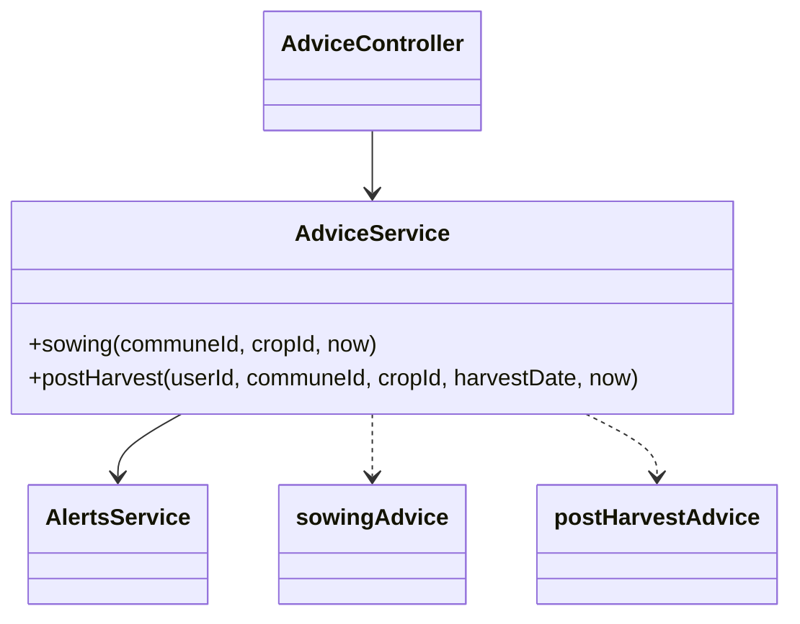

# Package advice

```mermaid
classDiagram
%% source: backend/src/advice, backend/src/alerts, backend/src/domain
class AdviceController
class AdviceService {
  +sowing(communeId, cropId, now)
  +postHarvest(userId, communeId, cropId, harvestDate, now)
}
AdviceController --> AdviceService
AdviceService --> AlertsService
AdviceService ..> sowingAdvice
AdviceService ..> postHarvestAdvice
```
