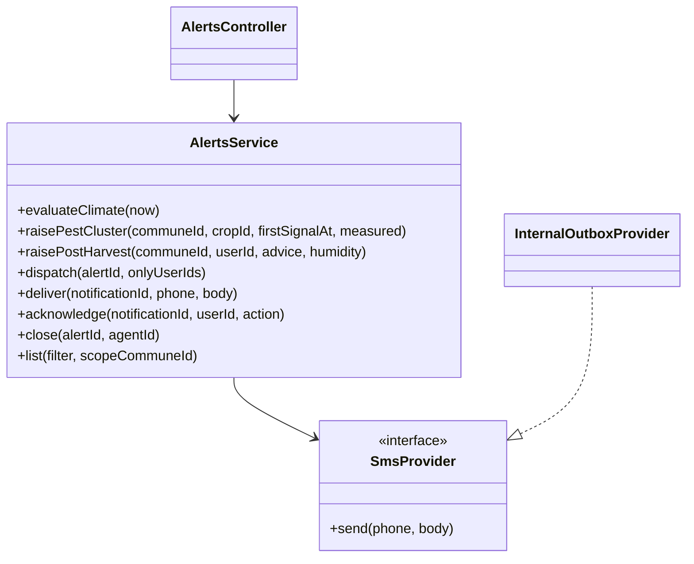

# Package alerts

```mermaid
classDiagram
%% source: backend/src/alerts
class AlertsController
class AlertsService {
  +evaluateClimate(now)
  +raisePestCluster(communeId, cropId, firstSignalAt, measured)
  +raisePostHarvest(communeId, userId, advice, humidity)
  +dispatch(alertId, onlyUserIds)
  +deliver(notificationId, phone, body)
  +acknowledge(notificationId, userId, action)
  +close(alertId, agentId)
  +list(filter, scopeCommuneId)
}
class SmsProvider {
  <<interface>>
  +send(phone, body)
}
class InternalOutboxProvider
AlertsController --> AlertsService
AlertsService --> SmsProvider
InternalOutboxProvider ..|> SmsProvider
```

`SmsProvider` est l'interface à remplacer par un vrai fournisseur SMS (agrégateur local ou API opérateur) sans toucher au reste.
