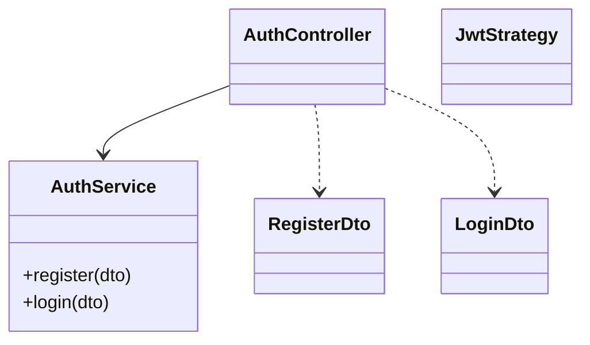

# Package auth

```mermaid
classDiagram
%% source: backend/src/auth
class AuthController
class AuthService {
  +register(dto)
  +login(dto)
}
class RegisterDto
class LoginDto
class JwtStrategy
AuthController --> AuthService
AuthController ..> RegisterDto
AuthController ..> LoginDto
```
