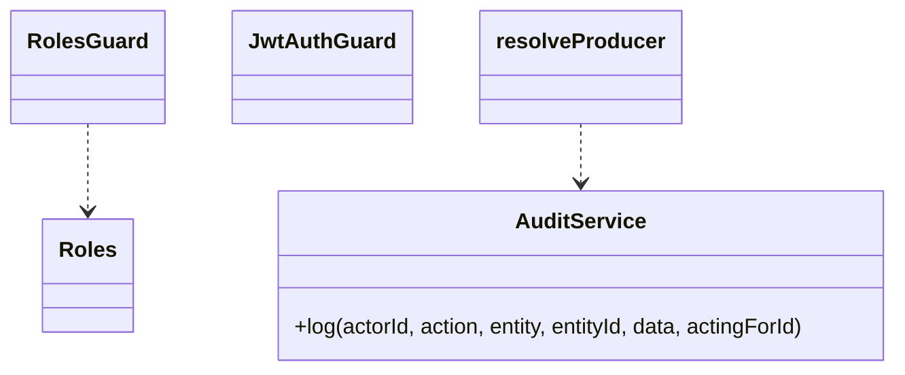

# Package common

```mermaid
classDiagram
%% source: backend/src/common
class AuditService {
  +log(actorId, action, entity, entityId, data, actingForId)
}
class RolesGuard
class JwtAuthGuard
class resolveProducer
RolesGuard ..> Roles
resolveProducer ..> AuditService
```
