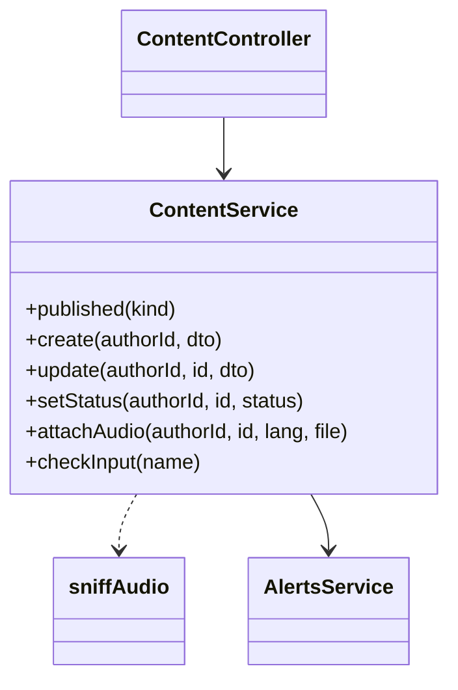

# Package content

```mermaid
classDiagram
%% source: backend/src/content, backend/src/alerts
class ContentController
class ContentService {
  +published(kind)
  +create(authorId, dto)
  +update(authorId, id, dto)
  +setStatus(authorId, id, status)
  +attachAudio(authorId, id, lang, file)
  +checkInput(name)
}
class sniffAudio
ContentController --> ContentService
ContentService ..> sniffAudio
ContentService --> AlertsService
```
