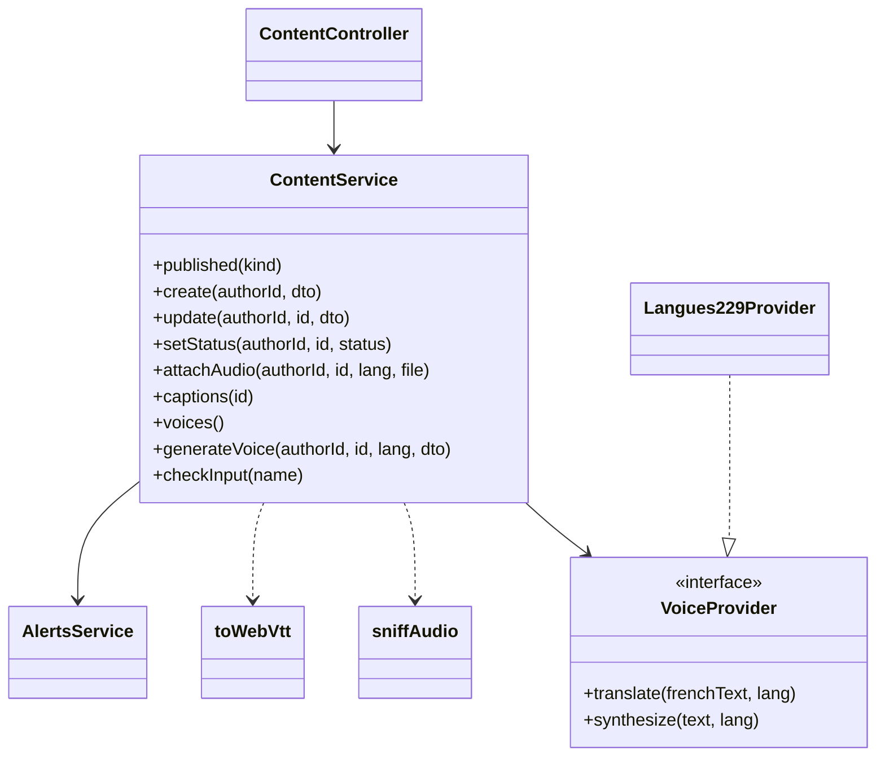

# Package content

```mermaid
classDiagram
%% source: backend/src/content, backend/src/alerts, backend/src/domain
class ContentController
class ContentService {
  +published(kind)
  +create(authorId, dto)
  +update(authorId, id, dto)
  +setStatus(authorId, id, status)
  +attachAudio(authorId, id, lang, file)
  +captions(id)
  +voices()
  +generateVoice(authorId, id, lang, dto)
  +checkInput(name)
}
class VoiceProvider {
  <<interface>>
  +translate(frenchText, lang)
  +synthesize(text, lang)
}
class Langues229Provider
class sniffAudio
class toWebVtt
ContentController --> ContentService
ContentService --> VoiceProvider
Langues229Provider ..|> VoiceProvider
ContentService ..> sniffAudio
ContentService ..> toWebVtt
ContentService --> AlertsService
```
