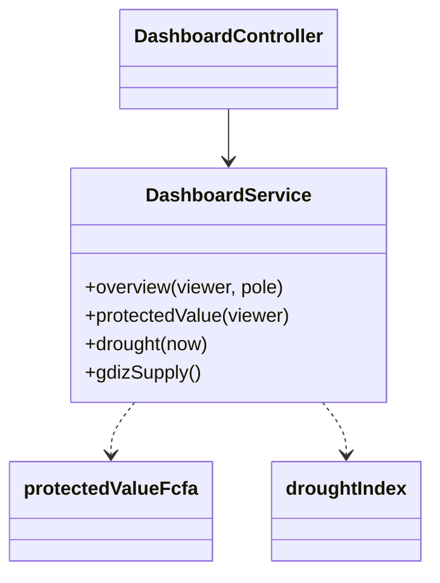

# Package dashboard

```mermaid
classDiagram
%% source: backend/src/dashboard, backend/src/domain
class DashboardController
class DashboardService {
  +overview(viewer, pole)
  +protectedValue(viewer)
  +drought(now)
  +gdizSupply()
}
DashboardController --> DashboardService
DashboardService ..> protectedValueFcfa
DashboardService ..> droughtIndex
```
