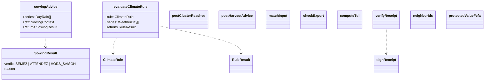

# Package domain

Fonctions pures, testées dans `backend/src/domain/domain.spec.ts`.

```mermaid
classDiagram
%% source: backend/src/domain
class sowingAdvice {
  +series: DayRain[]
  +ctx: SowingContext
  +returns SowingResult
}
class SowingResult {
  verdict SEMEZ | ATTENDEZ | HORS_SAISON
  reason
}
class evaluateClimateRule {
  +rule: ClimateRule
  +series: WeatherDay[]
  +returns RuleResult
}
class pestClusterReached
class postHarvestAdvice
class matchInput
class checkExport
class computeTdl
class signReceipt
class verifyReceipt
class neighborIds
class protectedValueFcfa
sowingAdvice ..> SowingResult
evaluateClimateRule ..> ClimateRule
evaluateClimateRule ..> RuleResult
verifyReceipt ..> signReceipt
```
