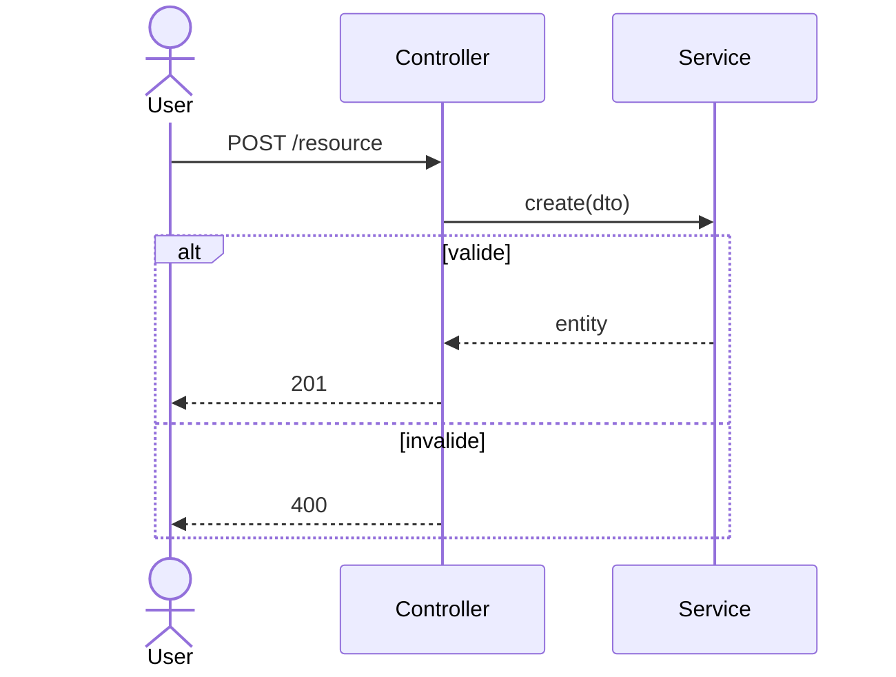

# Flux : <nom>

```mermaid
sequenceDiagram
%% source: src/<module>/<fichier>.ts
  actor User
  participant Controller
  participant Service
  User->>Controller: POST /resource
  Controller->>Service: create(dto)
  alt valide
    Service-->>Controller: entity
    Controller-->>User: 201
  else invalide
    Controller-->>User: 400
  end
```
