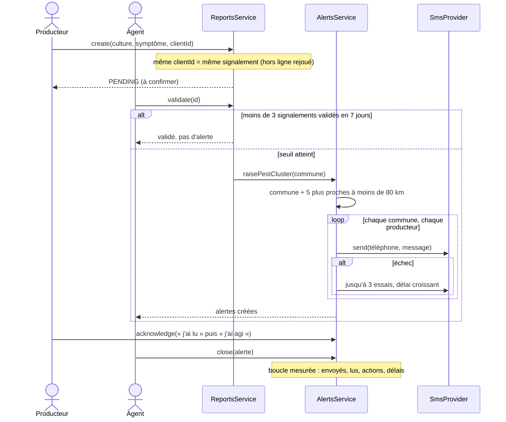

# Flux : du signalement de ravageur à l'alerte des communes voisines

```mermaid
sequenceDiagram
%% source: backend/src/reports, backend/src/alerts
  actor Producteur
  actor Agent
  participant ReportsService
  participant AlertsService
  participant SmsProvider
  Producteur->>ReportsService: create(culture, symptôme, clientId)
  Note over ReportsService: même clientId = même signalement (hors ligne rejoué)
  ReportsService-->>Producteur: PENDING (à confirmer)
  Agent->>ReportsService: validate(id)
  alt moins de 3 signalements validés en 7 jours
    ReportsService-->>Agent: validé, pas d'alerte
  else seuil atteint
    ReportsService->>AlertsService: raisePestCluster(commune)
    AlertsService->>AlertsService: commune + 5 plus proches à moins de 80 km
    loop chaque commune, chaque producteur
      AlertsService->>SmsProvider: send(téléphone, message)
      alt échec
        AlertsService->>SmsProvider: jusqu'à 3 essais, délai croissant
      end
    end
    AlertsService-->>Agent: alertes créées
  end
  Producteur->>AlertsService: acknowledge(« j'ai lu » puis « j'ai agi »)
  Agent->>AlertsService: close(alerte)
  Note over AlertsService: boucle mesurée : envoyés, lus, actions, délais
```
