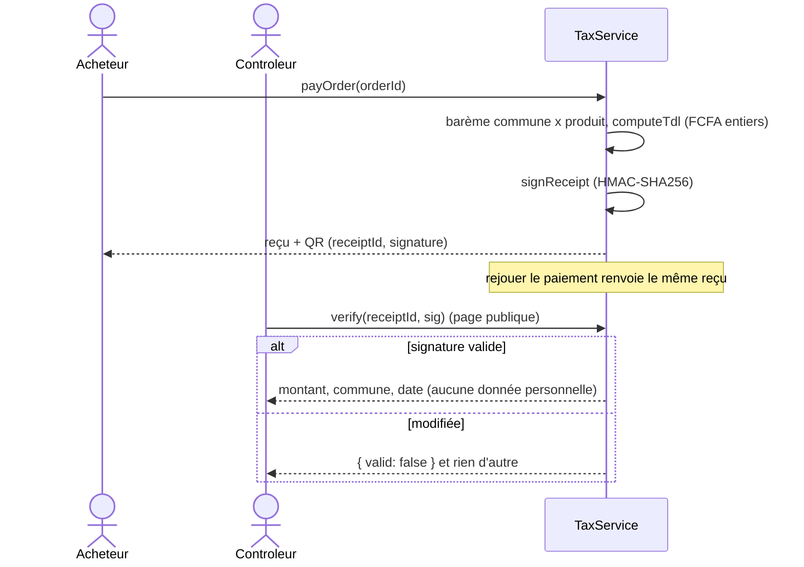

# Flux : paiement de la TDL et vérification du reçu

```mermaid
sequenceDiagram
%% source: backend/src/tax, backend/src/domain
  actor Acheteur
  actor Controleur
  participant TaxService
  Acheteur->>TaxService: payOrder(orderId)
  TaxService->>TaxService: barème commune x produit, computeTdl (FCFA entiers)
  TaxService->>TaxService: signReceipt (HMAC-SHA256)
  TaxService-->>Acheteur: reçu + QR (receiptId, signature)
  Note over TaxService: rejouer le paiement renvoie le même reçu
  Controleur->>TaxService: verify(receiptId, sig) (page publique)
  alt signature valide
    TaxService-->>Controleur: montant, commune, date (aucune donnée personnelle)
  else modifiée
    TaxService-->>Controleur: { valid: false } et rien d'autre
  end
```
