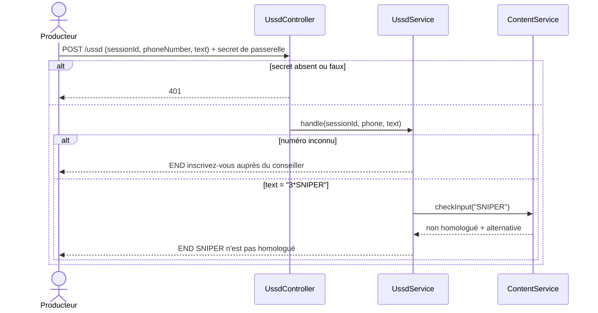

# Flux : une session USSD

```mermaid
sequenceDiagram
%% source: backend/src/ussd, backend/src/content
  actor Producteur
  participant UssdController
  participant UssdService
  participant ContentService
  Producteur->>UssdController: POST /ussd (sessionId, phoneNumber, text) + secret de passerelle
  alt secret absent ou faux
    UssdController-->>Producteur: 401
  else
    UssdController->>UssdService: handle(sessionId, phone, text)
    alt numéro inconnu
      UssdService-->>Producteur: END inscrivez-vous auprès du conseiller
    else text = "3*SNIPER"
      UssdService->>ContentService: checkInput("SNIPER")
      ContentService-->>UssdService: non homologué + alternative
      UssdService-->>Producteur: END SNIPER n'est pas homologué
    end
  end
```

Le téléphone de démonstration (`POST /ussd/simulate`) exécute le même menu, uniquement avec le numéro de l'utilisateur connecté.
