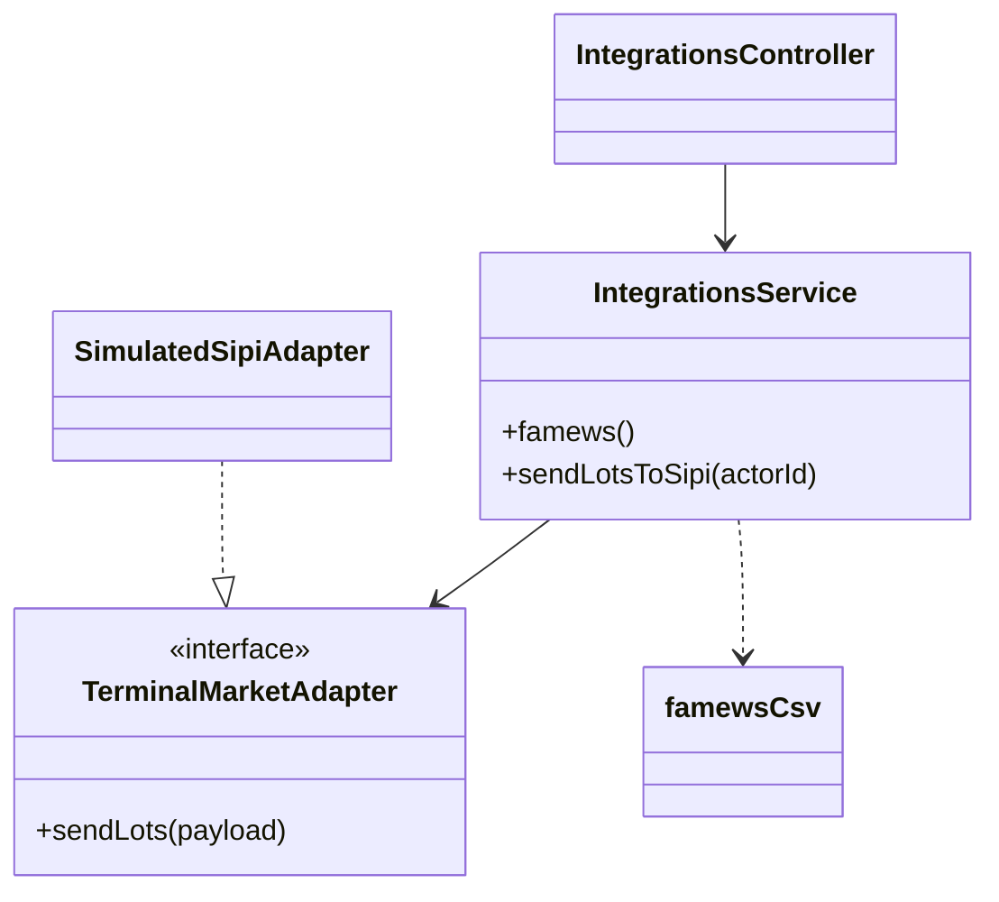

# Package integrations

```mermaid
classDiagram
%% source: backend/src/integrations, backend/src/domain
class IntegrationsController
class IntegrationsService {
  +famews()
  +sendLotsToSipi(actorId)
}
class TerminalMarketAdapter {
  <<interface>>
  +sendLots(payload)
}
class SimulatedSipiAdapter
IntegrationsController --> IntegrationsService
IntegrationsService --> TerminalMarketAdapter
SimulatedSipiAdapter ..|> TerminalMarketAdapter
IntegrationsService ..> famewsCsv
```
