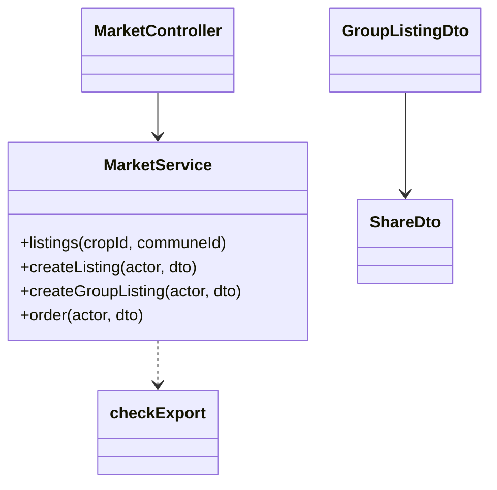

# Package market

```mermaid
classDiagram
%% source: backend/src/market, backend/src/domain
class MarketController
class MarketService {
  +listings(cropId, communeId)
  +createListing(actor, dto)
  +createGroupListing(actor, dto)
  +order(actor, dto)
}
class GroupListingDto
class ShareDto
MarketController --> MarketService
MarketService ..> checkExport
GroupListingDto --> ShareDto
```
