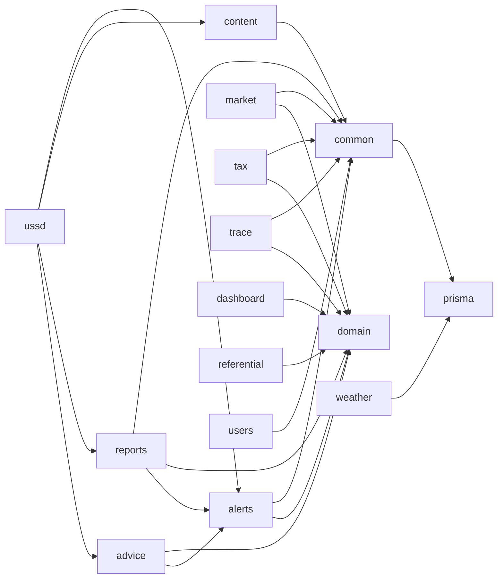

# Carte des packages

Backend NestJS, un module par domaine sous `backend/src`. Les règles métier sont des fonctions pures dans `domain`, sans dépendance au framework ni à la base, et testées à part.

| Package | Chemin | Responsabilité | Dépend de |
|---|---|---|---|
| domain | backend/src/domain | règles pures : semis, climat, foyers de ravageurs, post-récolte, intrants, export, TDL, valeur, géographie | aucun |
| prisma | backend/src/prisma | accès à PostgreSQL | aucun |
| auth | backend/src/auth | inscription (producteur, acheteur), connexion téléphone et PIN, JWT | prisma |
| common | backend/src/common | gardes de rôles, journal d'audit, action d'un conseiller au nom d'un producteur | prisma |
| referential | backend/src/referential | communes, cultures, voisinage | prisma, domain |
| users | backend/src/users | inscription des producteurs par un conseiller | common |
| weather | backend/src/weather | relevé Open-Meteo des 77 communes | prisma |
| alerts | backend/src/alerts | règles d'alerte, diffusion SMS, accusés, clôture, boucle | domain, common |
| advice | backend/src/advice | conseil de semis, conseil post-récolte | domain, alerts |
| reports | backend/src/reports | signalements de ravageurs, validation, déclenchement des foyers | domain, alerts, common |
| content | backend/src/content | CMS versionné, audio par langue, liste des intrants | domain, common |
| ussd | backend/src/ussd | menu USSD (passerelle et téléphone de démonstration) | advice, reports, content, alerts |
| market | backend/src/market | connecteur marché ouvert, blocage des exports, réservations | domain, common |
| tax | backend/src/tax | taxe de développement local, reçus signés, recettes | domain, common |
| trace | backend/src/trace | parcelles, lots, page publique du lot | domain, common |
| dashboard | backend/src/dashboard | carte, valeur protégée, offre face à la GDIZ | domain, prisma |

Frontend React (`frontend/src`) : `api.js` (client et file d'attente hors ligne), `ui.jsx` (composants, lecture vocale, QR), `pages/farmer.jsx`, `pages/market.jsx`, `pages/staff.jsx`.
