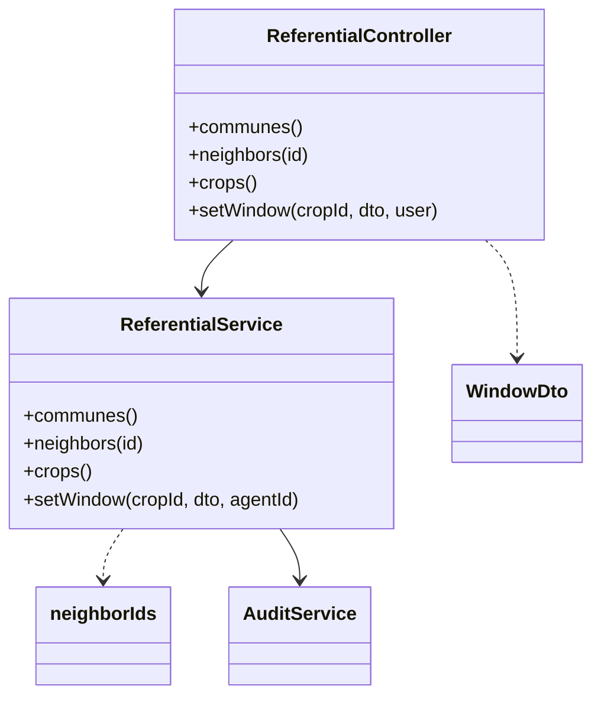

# Package referential

```mermaid
classDiagram
%% source: backend/src/referential, backend/src/domain, backend/src/common
class ReferentialController {
  +communes()
  +neighbors(id)
  +crops()
  +setWindow(cropId, dto, user)
}
class ReferentialService {
  +communes()
  +neighbors(id)
  +crops()
  +setWindow(cropId, dto, agentId)
}
class WindowDto
ReferentialController --> ReferentialService
ReferentialController ..> WindowDto
ReferentialService ..> neighborIds
ReferentialService --> AuditService
```
