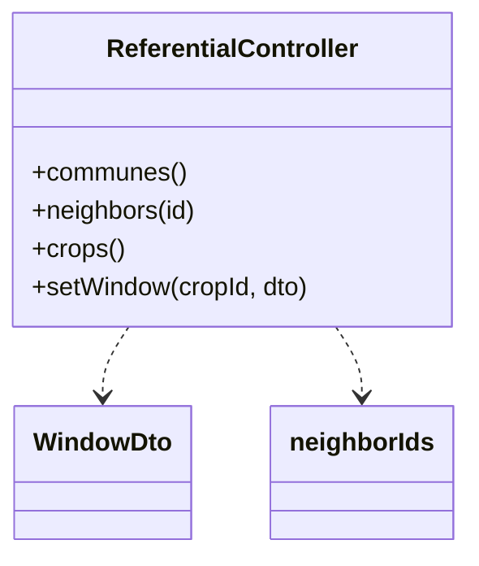

# Package referential

```mermaid
classDiagram
%% source: backend/src/referential, backend/src/domain
class ReferentialController {
  +communes()
  +neighbors(id)
  +crops()
  +setWindow(cropId, dto)
}
class WindowDto
ReferentialController ..> WindowDto
ReferentialController ..> neighborIds
```
