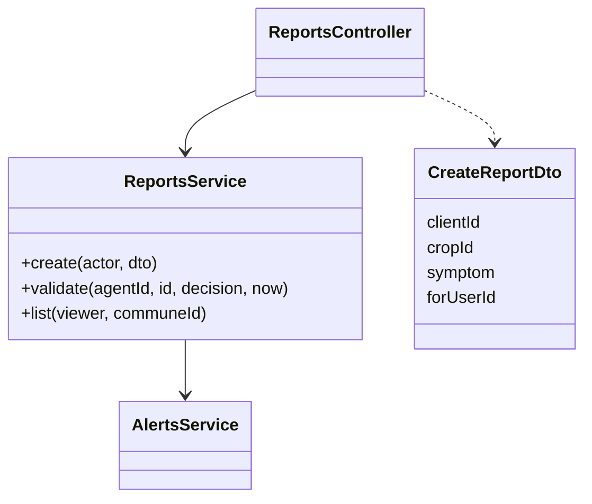

# Package reports

```mermaid
classDiagram
%% source: backend/src/reports, backend/src/alerts
class ReportsController
class ReportsService {
  +create(actor, dto)
  +validate(agentId, id, decision, now)
  +list(viewer, communeId)
}
class CreateReportDto {
  clientId
  cropId
  symptom
  forUserId
}
ReportsController --> ReportsService
ReportsController ..> CreateReportDto
ReportsService --> AlertsService
```
