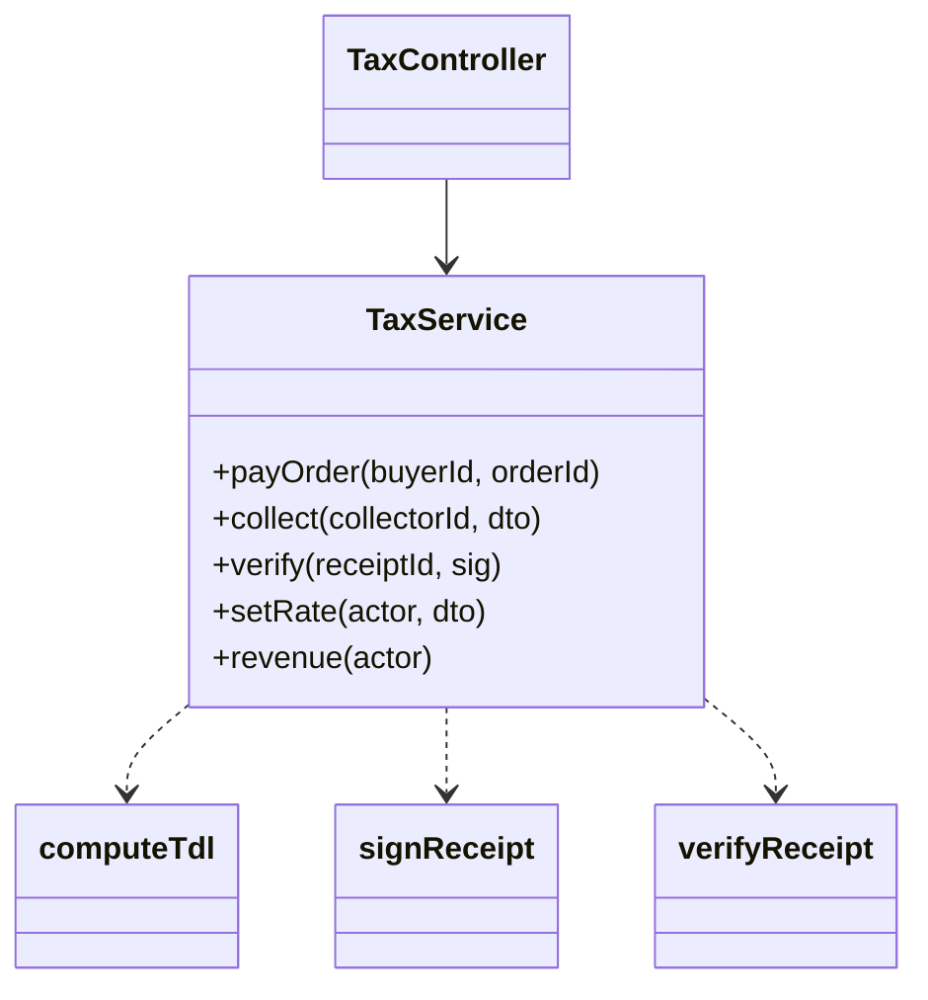

# Package tax

```mermaid
classDiagram
%% source: backend/src/tax, backend/src/domain
class TaxController
class TaxService {
  +payOrder(buyerId, orderId)
  +collect(collectorId, dto)
  +verify(receiptId, sig)
  +setRate(actor, dto)
  +revenue(actor)
}
TaxController --> TaxService
TaxService ..> computeTdl
TaxService ..> signReceipt
TaxService ..> verifyReceipt
```
