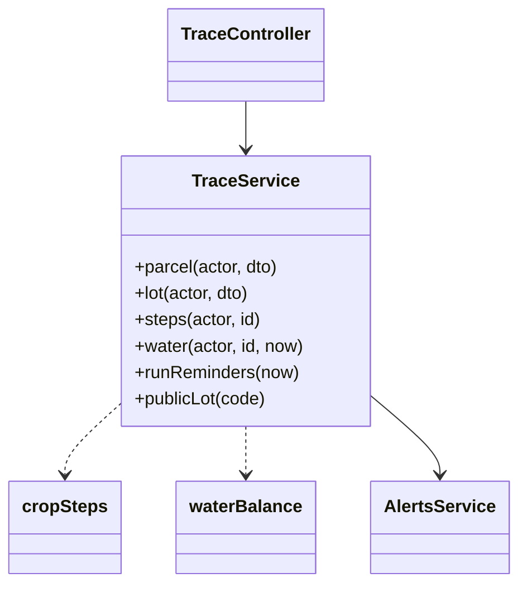

# Package trace

```mermaid
classDiagram
%% source: backend/src/trace, backend/src/domain, backend/src/alerts
class TraceController
class TraceService {
  +parcel(actor, dto)
  +lot(actor, dto)
  +steps(actor, id)
  +water(actor, id, now)
  +runReminders(now)
  +publicLot(code)
}
TraceController --> TraceService
TraceService ..> cropSteps
TraceService ..> waterBalance
TraceService --> AlertsService
```
