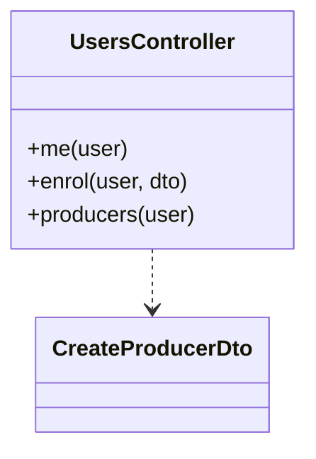

# Package users

```mermaid
classDiagram
%% source: backend/src/users
class UsersController {
  +me(user)
  +enrol(user, dto)
  +producers(user)
}
class CreateProducerDto
UsersController ..> CreateProducerDto
```
