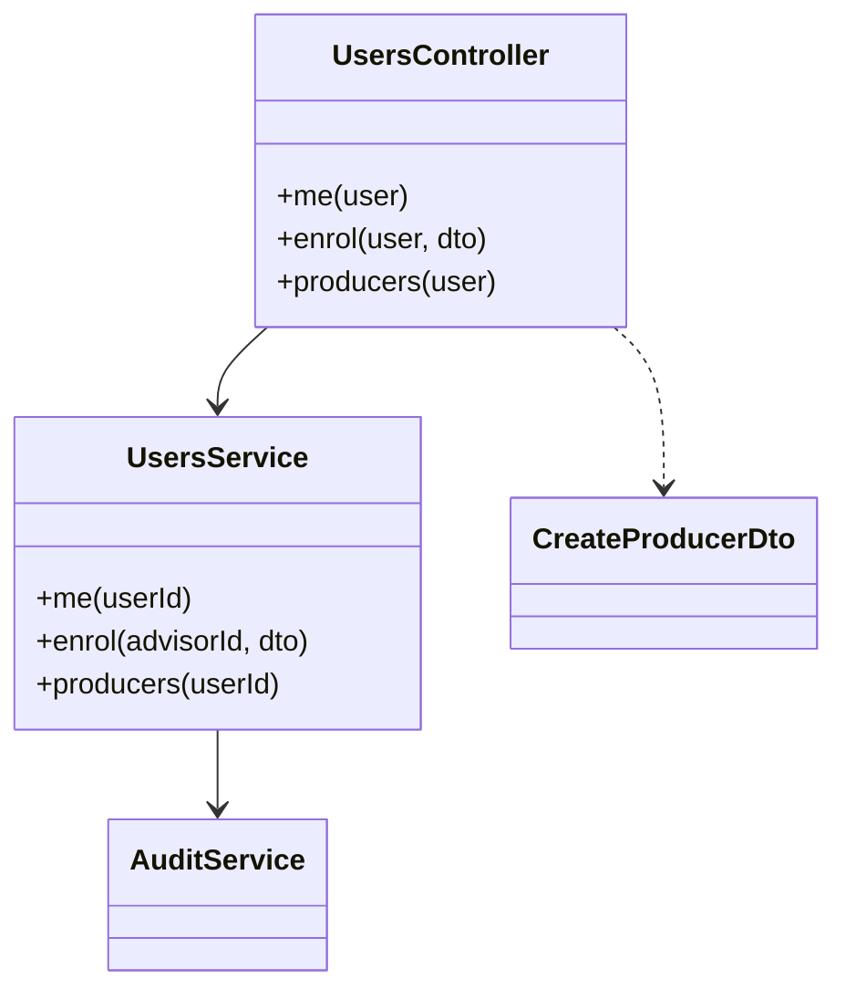

# Package users

```mermaid
classDiagram
%% source: backend/src/users, backend/src/common
class UsersController {
  +me(user)
  +enrol(user, dto)
  +producers(user)
}
class UsersService {
  +me(userId)
  +enrol(advisorId, dto)
  +producers(userId)
}
class CreateProducerDto
UsersController --> UsersService
UsersController ..> CreateProducerDto
UsersService --> AuditService
```
