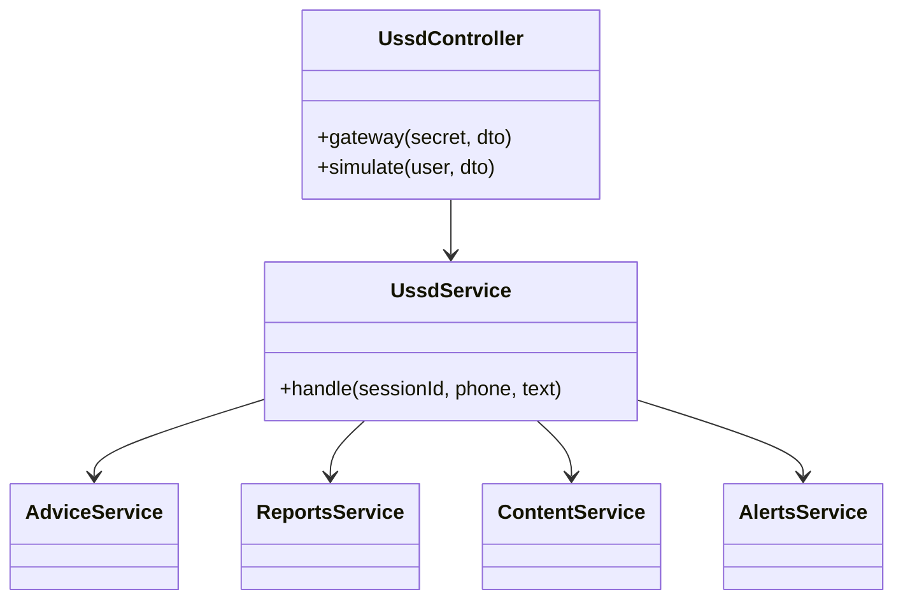

# Package ussd

```mermaid
classDiagram
%% source: backend/src/ussd, backend/src/advice, backend/src/reports, backend/src/content, backend/src/alerts
class UssdController {
  +gateway(secret, dto)
  +simulate(user, dto)
}
class UssdService {
  +handle(sessionId, phone, text)
}
UssdController --> UssdService
UssdService --> AdviceService
UssdService --> ReportsService
UssdService --> ContentService
UssdService --> AlertsService
```
