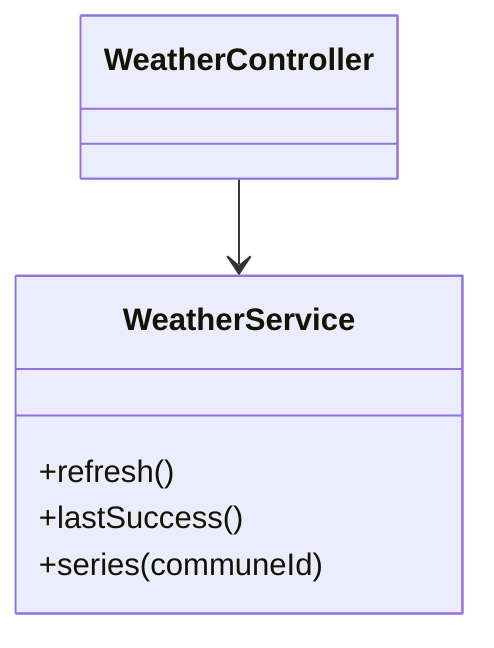

# Package weather

```mermaid
classDiagram
%% source: backend/src/weather
class WeatherController
class WeatherService {
  +refresh()
  +lastSuccess()
  +series(communeId)
}
WeatherController --> WeatherService
```
